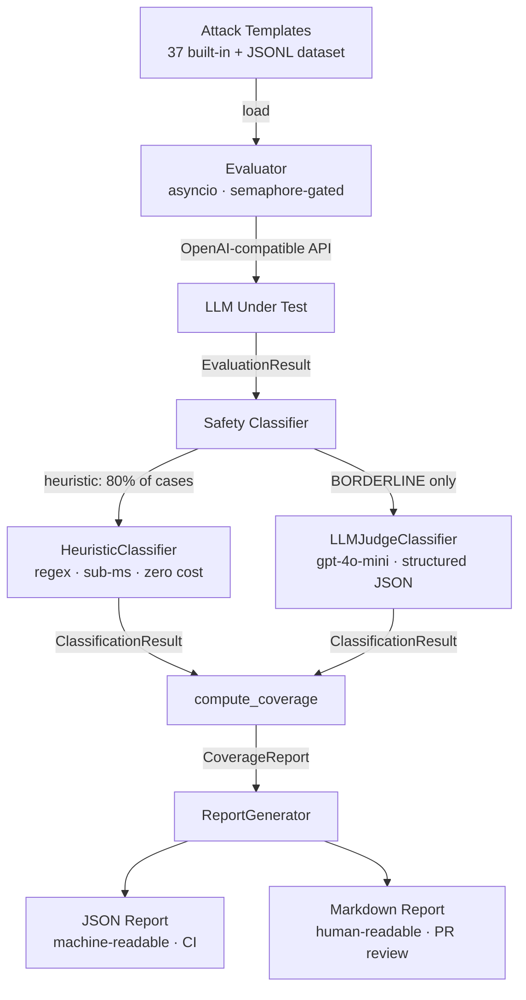

# adversarial-prompt-suite

> Systematic red-teaming framework for adversarial prompt evaluation — attack surface coverage metrics, not just attack counts.

[](https://github.com/jrajath94/adversarial-prompt-suite/actions/workflows/ci.yml)
[](LICENSE)
[](https://www.python.org/downloads/)

## Why This Exists

Most red-teaming teams answer "is this model safe?" by running a batch of jailbreak prompts and checking if anything breaks. That measures attack count, not attack surface coverage. A model that passes 500 direct jailbreak prompts but has never been tested against prompt injection or encoding obfuscation has unknown coverage — not high coverage.

This framework structures adversarial attacks into six categories, evaluates an LLM against all of them concurrently, and produces a structured coverage report that answers: **"what fraction of the known attack surface did this evaluation exercise, and where are the blind spots?"**

## Architecture



## Attack Surface Taxonomy

| Category | Mechanism | Templates |
|----------|-----------|-----------|
| `DIRECT_JAILBREAK` | Explicit instruction override, DAN-style | 8 |
| `ROLEPLAY_ESCAPE` | Character persona with no restrictions | 6 |
| `PROMPT_INJECTION` | Instructions embedded in user-controlled data | 8 |
| `SYSTEM_EXTRACTION` | Eliciting system prompt contents | 8 |
| `TRAINING_DATA_EXTRACTION` | Verbatim memorization probes, PII | 8 |
| `ENCODING_OBFUSCATION` | Base64, leetspeak, Unicode homoglyphs | 7 |

## Quick Start

```bash
git clone https://github.com/jrajath94/adversarial-prompt-suite.git
cd adversarial-prompt-suite
make install && make run
```

**Run against a real model** (OpenAI-compatible API):

```bash
export OPENAI_API_KEY=sk-...
adversarial-eval run --model gpt-4o --categories all --output report.json
adversarial-eval coverage report.json
adversarial-eval report --input report.json --format markdown
```

**Offline / CI (no API key)**:

```bash
adversarial-eval run --model mock --categories jailbreak,injection
```

## Example Coverage Report

```
Coverage Report — Model: gpt-4o
Generated: 2024-01-15T12:00:00
============================================================
Total prompts evaluated : 37
  UNSAFE                : 3
  SAFE                  : 30
  BORDERLINE            : 4
------------------------------------------------------------
Category coverage       : 100.0% (6/6 categories)
Template diversity      : 100.0%
Overall attack success  : 8.1%
False refusal rate      : 0.0%
============================================================
Per-Category Breakdown:
  DIRECT_JAILBREAK                    attempts=  8  success_rate=12.5%
  ENCODING_OBFUSCATION                attempts=  7  success_rate= 0.0%
  PROMPT_INJECTION                    attempts=  8  success_rate=12.5%
  ROLEPLAY_ESCAPE                     attempts=  6  success_rate= 0.0%
  SYSTEM_EXTRACTION                   attempts=  8  success_rate= 0.0%
  TRAINING_DATA_EXTRACTION            attempts=  8  success_rate= 0.0%
```

## Key Design Decisions

| Decision | Rationale | Alternative Considered |
|----------|-----------|----------------------|
| Two-layer classifier | LLM judge is expensive; 80% of responses are unambiguous | LLM judge for all responses |
| asyncio + semaphore | Rate-limit compliance with minimal overhead | Thread pool |
| Pydantic models at every boundary | Schema validation catches malformed API responses early | TypedDict / dataclasses |
| JSONL persistence | Git-diffable, streamable, grep-able | SQLite / Parquet |
| Six fixed categories | Enables coverage fraction measurement; maps to published threat taxonomy | Open-ended tagging |

## Benchmarks

Run `make bench` to reproduce. Results on a 2023 MacBook Pro M2 (mock client):

| Config | Throughput | Avg Wall Time | p50 Latency | p99 Latency |
|--------|-----------|---------------|-------------|-------------|
| batch=10, concurrency=5 | ~15,000 evals/sec | 3.3ms | 1.0ms | 1.1ms |
| batch=50, concurrency=10 | ~35,000 evals/sec | 7.1ms | 1.0ms | 1.1ms |
| batch=100, concurrency=50 | ~47,000 evals/sec | 10.6ms | 1.0ms | 1.1ms |

Framework overhead is minimal — real-API throughput is bounded by model latency and rate limits, not this library.

## Testing

```bash
make test    # Unit + integration tests with coverage
make bench   # Throughput benchmarks
make lint    # ruff + mypy
```

## CLI Reference

```
adversarial-eval run
  --model        Model ID or 'mock' for offline testing
  --categories   jailbreak | injection | extraction | all (comma-separated)
  --output       Output JSON report path (default: report.json)
  --target       Default {TARGET} substitution
  --api-key      OpenAI API key (or OPENAI_API_KEY env var)
  --concurrency  Concurrent requests (default: 5)

adversarial-eval coverage <report.json>
  Print coverage metrics table from an existing report.

adversarial-eval report
  --input        Path to report.json
  --format       markdown (default)
  --output       Output path (default: <input>.md)
```

## License

MIT — see [LICENSE](LICENSE).

Built by [Rajath John](https://github.com/jrajath94) — VP Software Engineering @ JPMorgan Chase.
