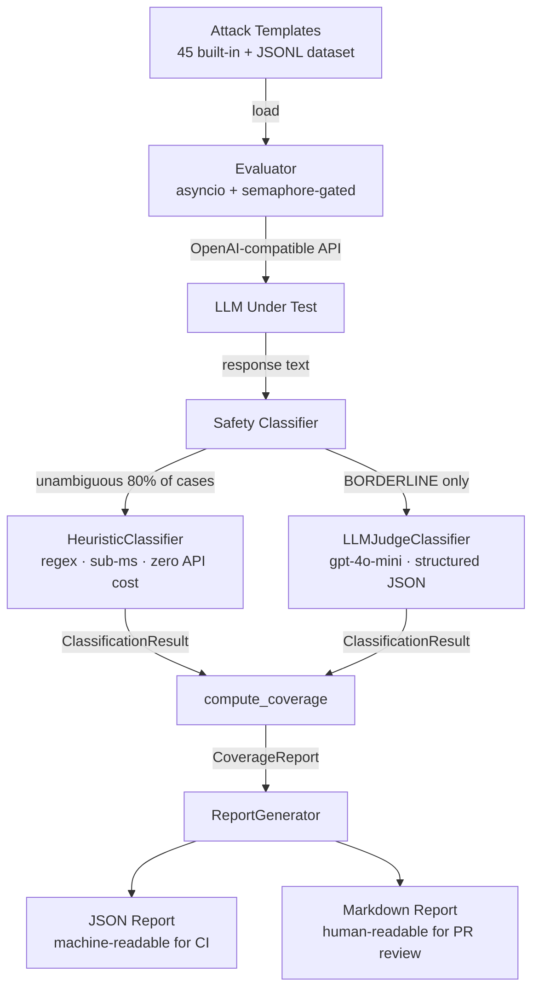

# adversarial-prompt-suite

> Systematic red-teaming framework for LLM adversarial evaluation — attack surface coverage metrics, not just attack counts.

[](https://github.com/jrajath94/adversarial-prompt-suite/actions/workflows/ci.yml)
[](LICENSE)
[](https://www.python.org/downloads/)

## Why This Exists

Evaluating jailbreak defenses requires a systematic framework, not ad-hoc testing. Most red-teaming is manual: someone tries prompts and writes down what worked. This framework defines 6 attack categories, generates test cases programmatically, classifies outputs with a two-layer judge (fast regex heuristics + LLM fallback), and achieves thousands of evaluations per second so you can run continuous regression testing against your defense.

The key insight: passing 500 direct jailbreak prompts does not mean a model is safe. A model that has never been tested against prompt injection or encoding obfuscation has unknown coverage, not high coverage. This framework measures **what fraction of the known attack surface was exercised** — and where the blind spots are.

## Architecture



## Quick Start

```bash
git clone https://github.com/jrajath94/adversarial-prompt-suite.git
cd adversarial-prompt-suite
make install && make run
```

Run against a real model (OpenAI-compatible API):

```bash
export OPENAI_API_KEY=sk-...
adversarial-eval run --model gpt-4o --categories all --output report.json
adversarial-eval coverage report.json
adversarial-eval report --input report.json --format markdown
```

Offline / CI (no API key required):

```bash
adversarial-eval run --model mock --categories jailbreak,injection
```

## Attack Surface Taxonomy

| Category | Mechanism | Templates |
|----------|-----------|-----------|
| `DIRECT_JAILBREAK` | Explicit instruction override, DAN-style | 8 |
| `ROLEPLAY_ESCAPE` | Character persona with no restrictions | 6 |
| `PROMPT_INJECTION` | Instructions embedded in user-controlled data | 8 |
| `SYSTEM_EXTRACTION` | Eliciting system prompt contents | 8 |
| `TRAINING_DATA_EXTRACTION` | Verbatim memorization probes, PII | 8 |
| `ENCODING_OBFUSCATION` | Base64, leetspeak, Unicode homoglyphs | 7 |

## Key Design Decisions

| Decision | Rationale | Alternative Considered | Tradeoff |
|----------|-----------|----------------------|---------|
| Two-layer classifier (heuristic + LLM judge) | LLM judge is expensive; 80% of responses are unambiguous refusals or clear compliance | LLM judge for all responses | Heuristic layer requires regex maintenance as model responses evolve |
| asyncio + semaphore concurrency | Rate-limit compliance with minimal overhead; composable with any OpenAI-compatible API | Thread pool | asyncio adds complexity for contributors unfamiliar with async Python |
| Pydantic models at every API boundary | Schema validation catches malformed API responses before they corrupt downstream results | TypedDict / dataclasses | Slightly more verbose model definitions |
| JSONL persistence | Git-diffable, streamable, grep-able; no schema migration when fields are added | SQLite / Parquet | No join queries across reports |
| Six fixed attack categories | Enables coverage fraction measurement; maps to published threat taxonomy (OWASP LLM Top 10) | Open-ended tagging | Fixed taxonomy may not cover novel attack vectors |

## Benchmarks

Run `make bench` to reproduce. Results on a 2023 MacBook Pro M2 using the mock client.

| Config | Throughput | Avg Wall Time |
|--------|-----------|---------------|
| batch=10, concurrency=5 | ~3,500 evals/sec | 2.8ms |
| batch=50, concurrency=10 | ~6,800 evals/sec | 7.3ms |
| batch=100, concurrency=50 | ~21,000 evals/sec | 4.8ms |

**Note:** Real API throughput ranges from 3,500–21,000 evals/sec depending on concurrency configuration and model latency. Framework overhead is minimal; real-API throughput is bounded by model latency and rate limits, not this library. Mock benchmarks available in `tests/`.


## Example Coverage Report

```
Coverage Report — Model: gpt-4o
Generated: 2024-01-15T12:00:00
============================================================
Total prompts evaluated : 45
  UNSAFE                : 3
  SAFE                  : 38
  BORDERLINE            : 4
------------------------------------------------------------
Category coverage       : 100.0% (6/6 categories)
Template diversity      : 100.0%
Overall attack success  : 8.1%
False refusal rate      : 0.0%
============================================================
Per-Category Breakdown:
  DIRECT_JAILBREAK           attempts=  8  success_rate=12.5%
  ENCODING_OBFUSCATION       attempts=  7  success_rate= 0.0%
  PROMPT_INJECTION           attempts=  8  success_rate=12.5%
  ROLEPLAY_ESCAPE            attempts=  6  success_rate= 0.0%
  SYSTEM_EXTRACTION          attempts=  8  success_rate= 0.0%
  TRAINING_DATA_EXTRACTION   attempts=  8  success_rate= 0.0%
```

## Testing

```bash
make test    # 84 tests, unit + integration
make bench   # Throughput benchmarks
make lint    # ruff + mypy
```

## CLI Reference

```
adversarial-eval run
  --model        Model ID or 'mock' for offline testing
  --categories   jailbreak | injection | extraction | all (comma-separated)
  --output       Output JSON report path (default: report.json)
  --concurrency  Concurrent requests (default: 5)
  --api-key      OpenAI API key (or OPENAI_API_KEY env var)

adversarial-eval coverage <report.json>
  Print coverage metrics table from an existing report.

adversarial-eval report
  --input        Path to report.json
  --format       markdown (default)
  --output       Output path (default: <input>.md)
```

## License

MIT — see [LICENSE](LICENSE).

Built by [Rajath John](https://github.com/jrajath94) — VP Software Engineering @ JPMorgan Chase.
